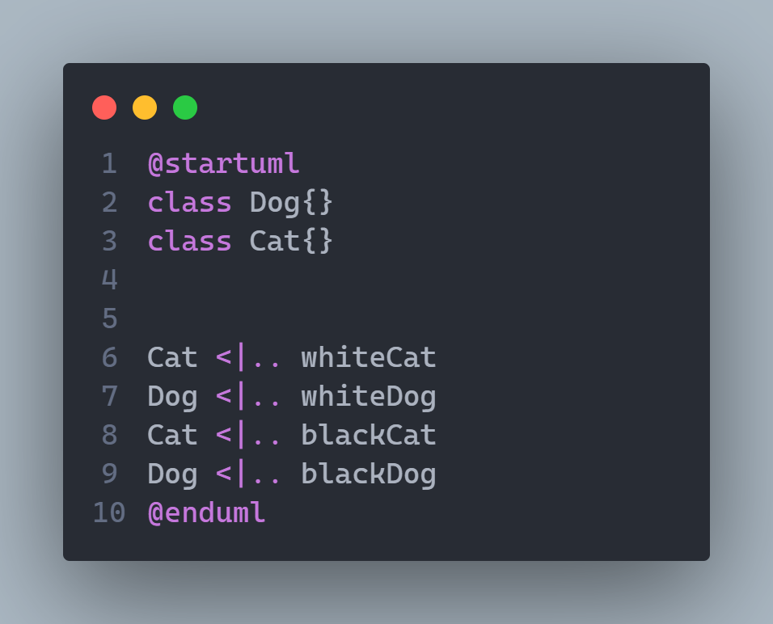

# Lab-02 ผลการทดลอง

### บันทึกผลการทดลองในไฟล์นี้

##  2.6.1  ให้คัดลอก code ไปเขียนใน plantUML เพื่อให้เกิดภาพ class diagram ดังรูปต่อไปนี้

-------------

## 2.6.2 ให้เขียน code เพื่อให้เกิดภาพ class diagram ดังรูปต่อไปนี้

-------------

## 2.6.3 ให้นำ code ในรูปนี้ไปเขียนใน plantUML จะได้รูปคลาสไดอะแกรมแบบใดออกมา

-------------

## 2.6.4 จงเขียน code ตามตัวอย่างในด้านขวาให้สมบูรณ์เพื่อให้แสดงภาพตามไดอะแกรมในด้านซ้าย

-------------

## 2.6.5 จงเขียน code ตามตัวอย่างในด้านขวาให้สมบูรณ์เพื่อให้แสดงภาพตามไดอะแกรมในด้านซ้าย

-------------

## 2.6.6 จงเขียน code ตามตัวอย่างในด้านขวาให้สมบูรณ์เพื่อให้แสดงภาพตามไดอะแกรมในด้านซ้าย

-------------
