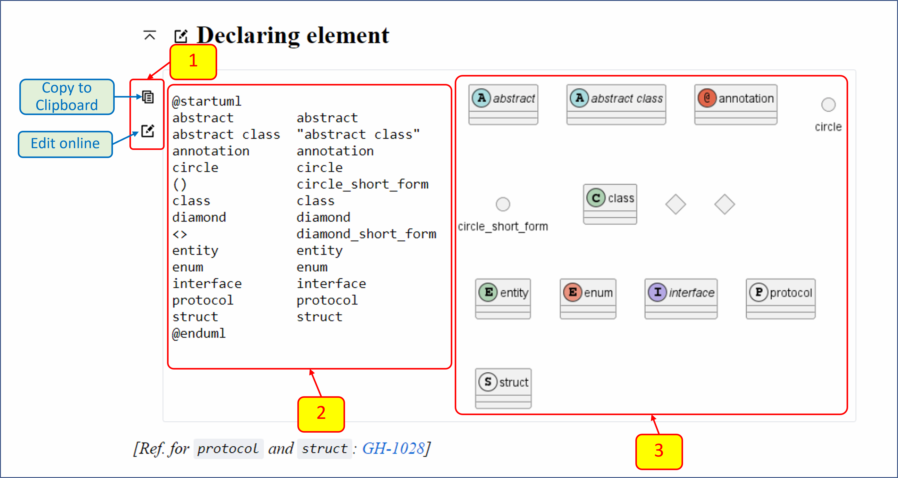
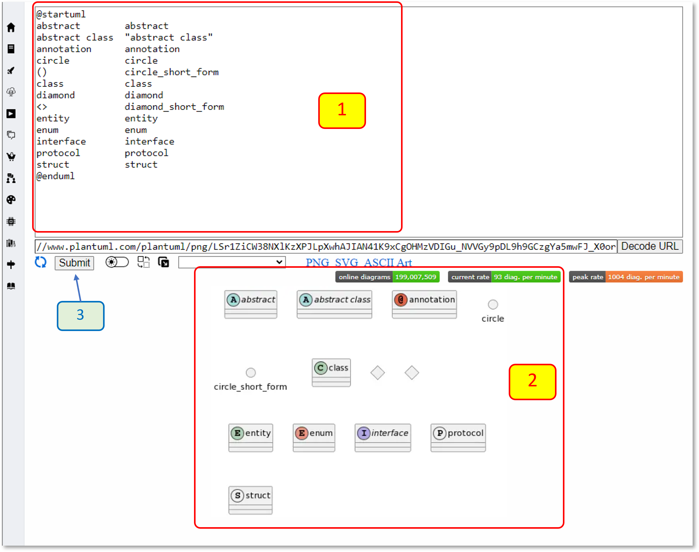
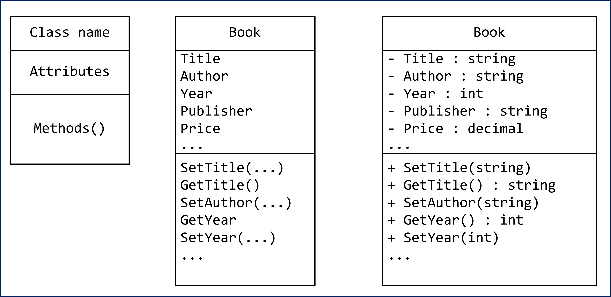

# Lab-02 การใช้งาน Plantuml 

## 2.4 แนะนำการใช้งาน Plantuml (Online)

### 2.4.1 ส่วน user interface ของเวบและการใช้งาน
การใช้งาน Plantuml ให้เข้าไปที่หน้า homepage  ของ PlantUML ตามลิงค์นี้  http://plantuml.com/en 

เมื่อเข้าไปยัง web site ดังกล่าว จะเห็นหน้าเพจดังรูป ซึ่งมีส่วนติดต่อผู้ใช้อยู่ 3 ส่วนหลักๆ คือ 

1. ส่วนเมนูหลัก
2. ส่วนเลือกชนิดของไดอะแกรม
3. ส่วนเนื้อหา

ให้คลิกที่เมนูส่วนที่สอง ในหัวข้อ class diagram จะปรากฏตัวอย่างการเขียน code เพื่อสร้าง class diagram ดังรูป

จะสังเกตุว่าด้านขวามือของ web browser จะมีเมนูย่อยสำหรับการกระโดดไปที่ตัวอย่างแต่ละหัวข้อ

ในหน้าต่างนี้เราสามารถแบ่งส่วนที่น่าสนใจได้ 3 ส่วน ได้แก่

1. ส่วนเมนูจัดการ code ซึ่งมี 2 ปุ่มให้เรียกใช้คือ `Copy to clipboard` และ `Edit online`
2. ส่วนของ Code
3. ส่วนของ graphics ที่ได้จากการ render ของ code ที่เขียนในส่วนที่ 2 

ในหัวข้อนี้ ให้นักศึกษาเริ่มจากตัวอย่างง่าย ๆ ได้แก่การสร้าง class รวมถึง element ต่าง ๆ ที่ใช้ในคลาสไดอะแกรม (ความหมายและการใช้งานของ element ต่าง ๆ นั้นเราจะทยอยเรียนไปตามลำดับเนื้อหา)  

เราสามารถทดลองแก้ไข code และ graphics ได้ด้วยใช้ online editor โดยการกดปุ่ม Edit online (เป็นปุ่มกดอยู่ในส่วนที่ 1 ของรูปด้านบน)

เมื่อเข้ามาในหน้า Edit online แล้วจะพบว่ามีส่วนที่น่าสนใจอยู่ 2 ส่วนคือ 

1. ส่วนของ code ที่สามารถแก้ไขได้
2. ส่วนแสดง graphic ที่ได้จาการเขียน code 

โดยเมื่อแก้ไข code แล้วเราสามารถสั่งให้หน้าเวบทำการ render ส่วนของ graphic ใหม่โดยการกดปุ่ม Submit [3]

# To be continued ...    

### 2.4.2 การเพิ่ม properties และ methods 

1. การเขียนคลาสอย่างง่าย

2. การเพิ่ม Attributes และ Methods ให้คลาส

3. การเพิ่ม Data type ให้ Attributes และ Methods 

### 2.4.3 การกำหนด  visibility ให้กับส่วนประกอบต่างๆ ของคลาส 

### 2.4.4 การแสดงคำอธิบาย (notes)

